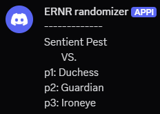
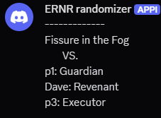

# ERNR-randomizer-discordbot

A Discord bot for generating random boss and class assignments for **Elden Ring: Nightreign**.

---

## Features

- **Random Boss & Classes:** Generates a random boss and three random classes for players. If you want to allow duplicate classes, set ALLOW_SAME_CLASS = True in randomiser_bot.py.
- **Custom Player Names:** Allows users to set custom player names using simple commands.
- **Easy to Use:** Just type a command in the designated channel!

---

## Usage

### 1. Random Boss & Classes

Type `§` in the specified channel to get a random boss and three random classes.



### 2. Custom Player Names

Change the default `p1`, `p2`, or `p3` names to your own by typing:

§p1 [Name]
§p2 [Name]
§p3 [Name]

**Example:**
§p2 Dave

After setting a name, the next randomizer output will display your custom name.



### 3. Remove classes from players

If player has completed remembrance or doesn't own Duchess or Revenant, classes can be removed from them:
Type `§p1r [classname]` to "player 1 remove [classname]".

---

## How to get started

1. **Install Python and discord.py**
   - Download Python 3.10: [Python 3.10 download page](https://www.python.org/downloads/release/python-3100/)
   - Run the installer and follow the instructions.
   - Make sure you know the path to your `python.exe` (for example, `C:\Python310\python.exe`).

2. **Clone this repository**
  git clone https://github.com/yourusername/ERN-randomizer-discordbot.git
    
  3. **Install dependencies**
- Open a terminal or command prompt.
- Navigate to the repository folder:
  ```
  cd ERNR-randomizer-discordbot
  ```
- Install the required package:
  ```
  pip install -r requirements.txt
  ```
  - Or, if you only want to install discord.py:
    ```
    pip install discord.py
    ```

## How to get a Discord bot token and enable intents

1. **Go to [Discord Developer Portal](https://discord.com/developers/)**
2. **Create a new application**
- Click "New Application"
- Name it (e.g., "ERNR randomizer") and create
3. **Open the "Bot" page**
- Set the bot to public
- Enable "Message Content Intent"
- Click "Reset Token" and copy the token
- **Never share your token publicly!**
4. **Add the token to your bot code**
- Open `randomiser_bot.py`
- Replace `TOKEN = "DISCORD TOKEN"` with your actual token:
  ```
  TOKEN = "your-token-here"  # Replace with your Discord bot token
  ```
- Save the file

---

## How to get a channel ID

1. **Enable Developer Mode in Discord**
- Go to Discord settings > Advanced > Enable Developer Mode
2. **Copy the channel ID**
- Right-click the channel in your Discord server
- Select "Copy Channel ID"
3. **Add the channel ID to your bot code**
- Open `randomiser_bot.py`
- Replace `CHANNEL_ID = 1234567890` with your actual channel ID:
  ```
  CHANNEL_ID = 1234567890  # Replace with your Discord channel ID
  ```
- Save the file

---

## How to run the bot

1. **Open a terminal or command prompt**
2. **Navigate to the repository folder**
3. **Run the bot**

---

## How to invite the bot to a server

1. **Go to [Discord Developer Portal](https://discord.com/developers/)**
2. **Select your application**
3. **Open the OAuth2 page**
4. **Under OAuth2 URL Generator, select "bot"**
5. **Under Bot Permissions, select "Send Messages" and "Manage Messages"**
6. **Copy the generated URL and open it in your browser**
7. **Select the server you want to add the bot to**

---
